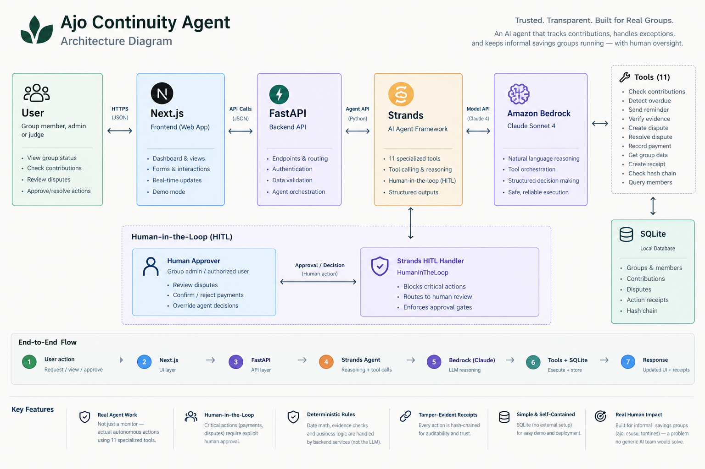

# Ajo Continuity Agent

**An AI agent that keeps community savings groups running smoothly by handling routine coordination, verifying payment evidence, and knowing when a decision needs a human.**

Built for the **AWS Agents for Humans Hackathon · Good Neighbor Agents track**



---

## The Problem

Ajo, also known as esusu, susu, or a tontine, is an informal rotating savings system where members contribute a fixed amount on a schedule and take turns receiving the pooled payout.

The system is simple. The coordination is not.

Someone still has to track who paid, who is late, whether payment evidence is valid, and what happens when the records do not agree.

The difficult cases are the exceptions. A member forgets to contribute. Someone says they paid but cannot provide matching evidence. A payment record conflicts with the evidence submitted.

At that point, someone has to investigate and make a decision, often from memory, under social pressure, with little or no audit trail.

**Ajo Continuity Agent handles the routine work and gives humans a clear, evidence-based handoff when something requires judgment.**

## What It Does

1. **Observes** the group's current state, including contributions, outstanding payments, and deadlines.
2. **Checks the group's rules** using deterministic application logic rather than asking an LLM to calculate financial state.
3. **Handles routine issues** such as identifying overdue contributions and processing verified payment evidence.
4. **Verifies evidence** against the group's registered payment records.
5. **Stops when evidence conflicts** instead of guessing which record is correct.
6. **Escalates exceptions** to a human with the relevant evidence clearly presented.
7. **Records consequential actions** in a tamper-evident audit trail.

The workflow is simple:

**routine → exception → evidence → decision → receipt**

The agent handles routine coordination. Humans remain responsible for consequential decisions.

## Why It's Safe by Design

The safety model is built into the system architecture, not just the agent's instructions.

* **The database is the source of truth.** The agent does not write financial records directly. It calls a tool, which passes through deterministic application logic before changing the database. Dates, overdue calculations, and evidence matching are handled by Python rather than generated by the LLM.

* **Sensitive actions are gated.** Payment recording and dispute resolution use Strands' `HumanInTheLoop` intervention mechanism. The agent cannot complete these actions without passing through the defined approval boundary.

* **Actions leave tamper-evident receipts.** Each receipt contains a hash of its own content and the previous receipt's hash, creating a verifiable chain. The implementation has been tested by modifying a stored receipt and confirming that the chain detects the change.

* **Human decisions remain human decisions.** Administrators can resolve disputes directly from the interface, while agent-initiated sensitive actions pause execution and wait for human approval.

## Tech Stack

* **Agent:** Strands Agents SDK + Amazon Bedrock (Claude Sonnet 4)
* **Backend:** FastAPI + SQLAlchemy + SQLite
* **Frontend:** Next.js + TypeScript + Tailwind CSS
* **Audit Trail:** Custom hash-chain implementation over the action log

## Getting Started

### Backend

```powershell
cd backend

python -m venv venv
venv\Scripts\activate.bat

pip install -r requirements.txt
copy .env.example .env
```

Configure `.env` with your AWS credentials, enable the required Claude model in Amazon Bedrock, and set `BEDROCK_MODEL_ID`.

See `backend/.env.example` for the currently configured model IDs and the required `us.` cross-region inference prefix for newer Bedrock models.

Then:

```powershell
python -m app.seed
python -m app.run_server
```

API documentation is available at:

`http://localhost:8000/docs`

See `backend/README.md` for backend-specific details and verification notes.

### Frontend

```powershell
cd frontend

npm install
npm run dev
```

Open:

`http://localhost:3000`

The frontend expects the backend at `http://localhost:8000` by default. Configure `NEXT_PUBLIC_API_BASE_URL` if the backend is hosted elsewhere.

See `frontend/README.md` for frontend-specific details.

## Demo Mode

The application includes a seeded demo group, **Udo Ajo Circle**, with 12 fictional members contributing ₦20,000 per week and a 48-hour grace period.

Demo Mode triggers the actual backend workflow rather than playing a scripted animation.

Available scenarios:

* **Missed payment** — detects an overdue contribution and initiates the appropriate routine workflow.
* **Member claims payment** — processes a payment claim without supporting evidence and requests proof.
* **Valid evidence** — matches submitted evidence against group records, proposes recording the payment, and pauses for human approval.
* **Conflicting evidence** — detects a mismatch and creates a dispute for human review.
* **Resolve dispute** — routes the case to the Disputes interface for a human decision.
* **Reset demo** — clears and reseeds the demo environment.

## Verification

The core workflow has been tested end-to-end against a live Bedrock model.

Verified:

* Core demo scenarios execute successfully.
* The `HumanInTheLoop` gate blocks `resolve_dispute` and `record_payment` as intended.
* The hash-chain audit trail detects tampering with stored receipts.
* The complete request path works from frontend → FastAPI → agent → Bedrock → tools → receipt.
* Frontend API integrations match tested backend response structures.

### Known Gaps

* Mobile layouts are not implemented.
* The segmented week-progress visualization from the original design is not implemented.
* Visual fidelity against the design mockups has not been pixel-verified in a browser-based environment.

See `frontend/README.md` for the full implementation and verification notes.

## License

MIT
